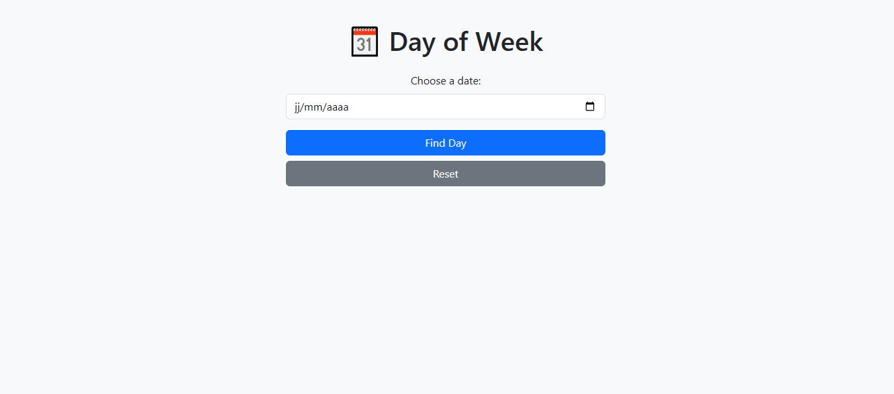

# 🗓️ Day of Week

A simple web application that tells you the day of the week for any date you select.

---

## 📋 General Description

**Day of Week** is a small, handy, and educational tool that lets you:
- 📅 Select a date using a date picker
- 🔍 See the corresponding **day of the week** (e.g., Monday, Tuesday, etc.)
- ♻️ Easily reset the input

---

## 🚀 Key Features

- ✅ Date input field (`<input type="date">`)
- ✅ Calculates the day of the week from the selected date
- ✅ Displays the result clearly
- ✅ "Reset" button to clear the input
- 📱 Responsive design for mobile and desktop

---

## 🛠️ Technologies Used

- 🌐 **HTML5** for structure
- 🎨 **CSS3 / Bootstrap 5** for styling
- ⚙️ **JavaScript / jQuery** for functionality

---

## 📸 Screenshot

You can add a preview image here:

```markdown


🔗 Live Demo
👉 👉 [Click here to try Day Of Week](https://projectsjavascript.github.io/Day-of-Week/)

## 📁 Project Structure

```

Day-of-Week/
├── index.html
├── script.js
├── screenshot.png
└── README.md

## 📄 License
This project is open-source under the MIT license.

### 🌐 Langue / Language

- 🇫🇷 [Lire en Français](./README.fr.md)
- 🇬🇧 [Read in English](./README.md)